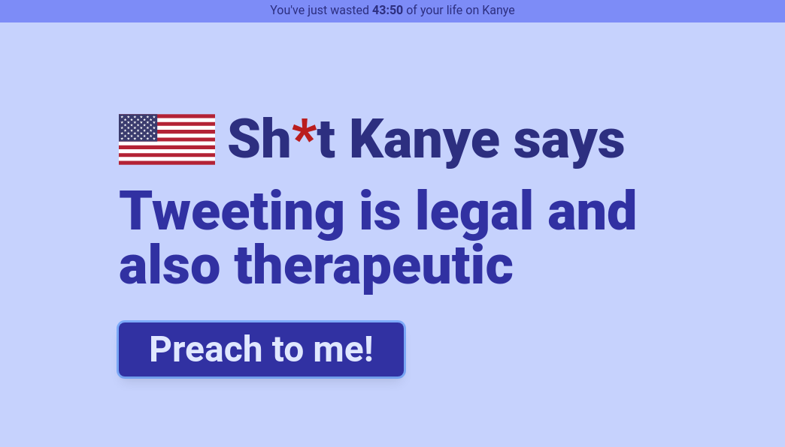

# solidjs-playground

> Simple Solid-JS app to take Solid-JS for a drive

This is example app for my blog post - [SolidJS - a first look](https://codechips.me/solidjs-first-look/).

## How to run

Clone and run `npm i && npm dev`

## There is more!

For more interesting stuff like this follow me on [Twitter](https://twitter.com/codechips) or check out my blog https://codechips.me

